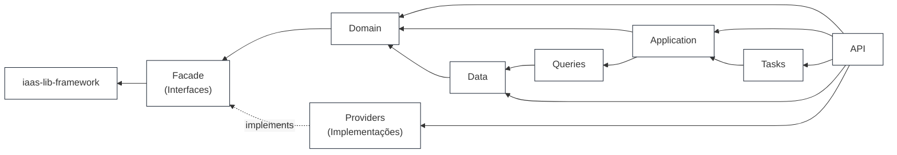

# Arquitetura em camadas

## O que cada camada é

| Camada | Projeto | Responsabilidade |
| --- | --- | --- |
| **API** | `LicitaEdital.Api` | Endpoints FastEndpoints (REPR), validação de request, composição de DI. É o único que enxerga todas as outras |
| **Tasks** | `LicitaEdital.Tasks` | Trabalho reativo e agendado: handler de evento de domínio, job de fila, rotina periódica |
| **Application** | `LicitaEdital.Application` | Commands, queries e handlers. Orquestra o domínio e consome os contratos de leitura |
| **Queries** | `LicitaEdital.Queries` | Lado de leitura: contexto sem rastreamento, query services e os contratos que eles cumprem |
| **Data** | `LicitaEdital.Data` | Escrita: `DbContext` por módulo, mapeamento, repositórios, migrations |
| **Domain** | `LicitaEdital.Domain` | Entidades, agregados, value objects, eventos, specifications. Zero framework |
| **Facade** | `LicitaEdital.Facade` | **Só interfaces** — os contratos que o domínio declara e alguém de fora cumpre. Mais o vocabulário compartilhado (ids opacos, `ValueRange`) |
| **Providers** | `LicitaEdital.Providers` | **Só implementações** dos contratos do `Facade` |
| `iaas-lib-framework` | `LicitaEdital.BuildingBlocks` | Lib proprietária, repositório irmão, consumida por pacote |

## As duas inversões que definem o desenho

**`Facade` fica abaixo de `Domain`, não acima.** O domínio declara o que precisa (`IEmailSender`,
`IUserAccountService`, `ICatalogFacade`) e depende só dessas interfaces; quem as cumpre é
`Providers`, que o domínio nunca vê. É inversão de dependência levada ao nível de projeto: a seta
`Providers -.-> Facade` é a única que aponta "para cima", e é pontilhada porque é implementação, não
referência de compilação do domínio.

Por isso o vocabulário compartilhado — `OrganizationId`, `UserId`, `OpportunityId`, `OfferingId`,
`ValueRange` — mora no `Facade`: os contratos precisam falar esses tipos, e `Facade` não pode
referenciar `Domain` sem criar ciclo.

**`Application` depende de `Queries`, não o contrário.** O lado de leitura é dono dos seus contratos
(`IListOpportunitiesQueryService`, `IAuthenticatedUserReader`) e dos DTOs que devolve, em
`Queries/Contracts/`. O caso de uso chama; `Queries` não sabe que `Application` existe.

## Uma consequência a conhecer

`Providers` referencia `Data` e `Queries`, o que o diagrama não mostra. O motivo é concreto: duas
das implementações do `Facade` são servidas pelo **nosso** banco, não por sistema externo —
`UserAccountService` roda sobre o store do ASP.NET Identity e `CatalogFacade` sobre o contexto de
leitura de Catalog.

O preço: a trava que impedia abrir transação em volta de chamada HTTP (spec §14 proíbe) era
estrutural — `Providers` não alcançava `DbContext` — e virou disciplina. Provider de sistema externo
(`Smtp/`, e adiante `Pncp/`, `Storage/`) continua sem motivo para tocar em `DbContext`. Para
restaurar a trava, essas duas implementações voltariam para `Data` e `Queries`, e `Providers`
ficaria só com integração externa.
