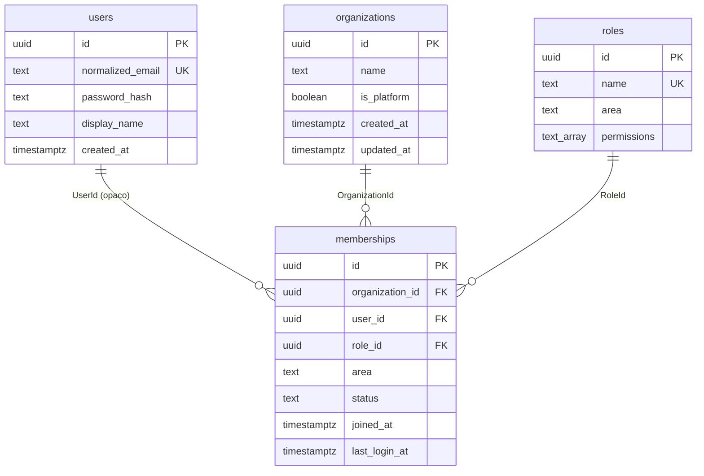
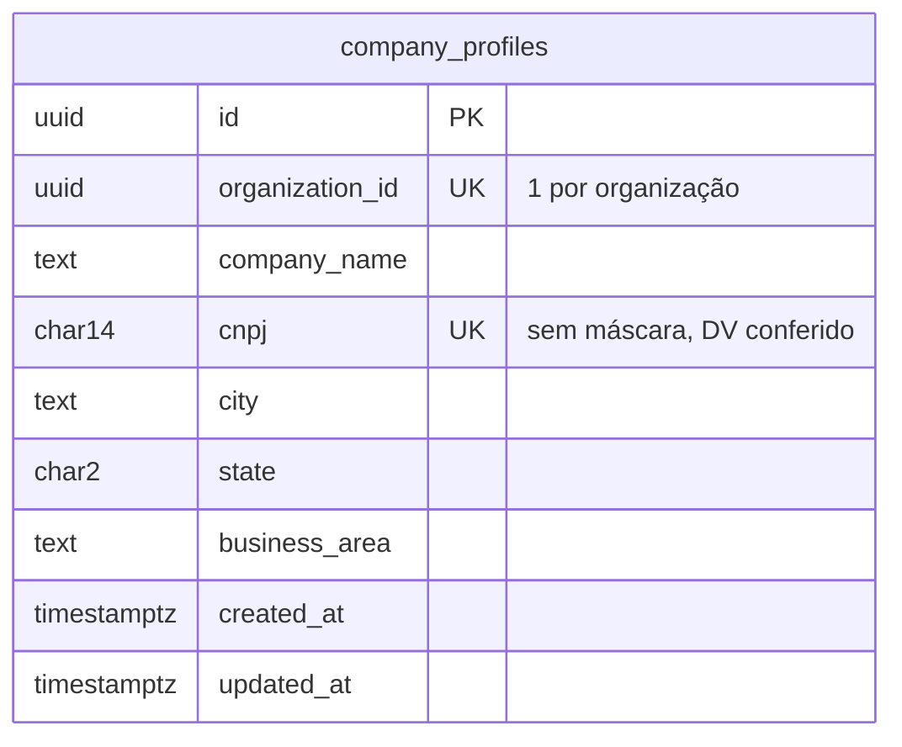
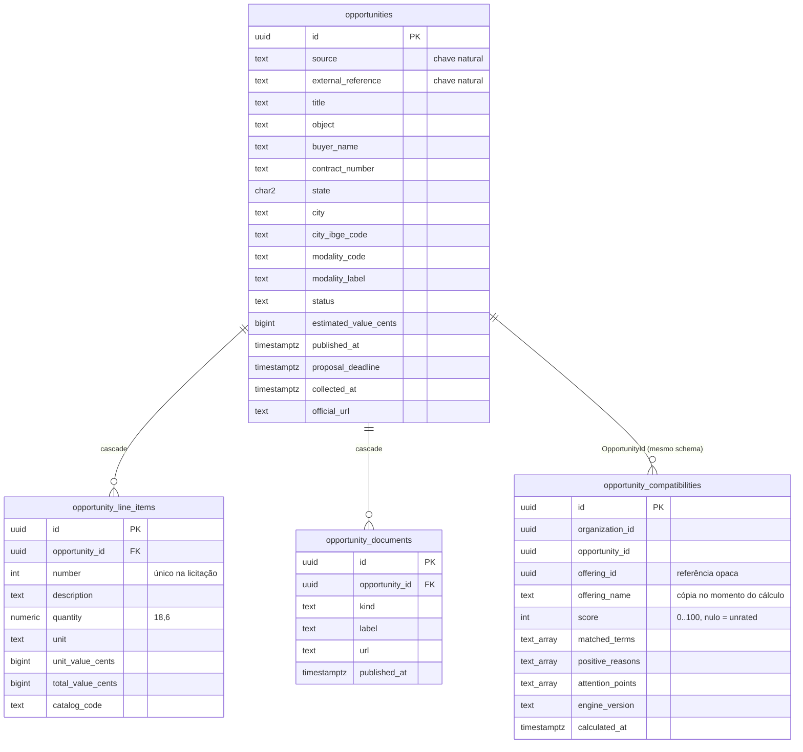
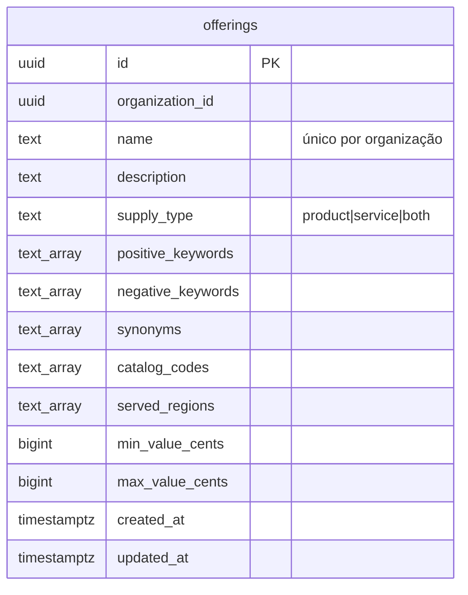
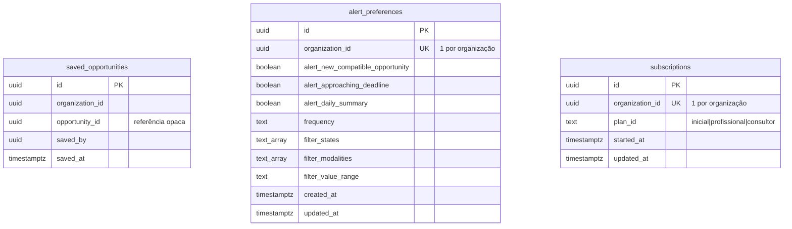
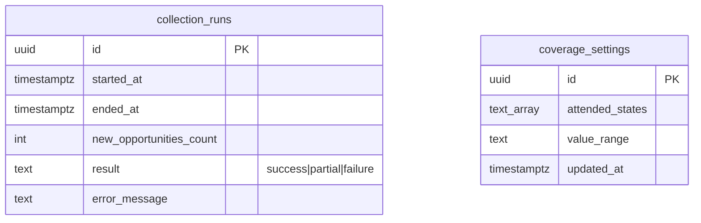

# Modelagem de dados

Entidades, relacionamentos e mapeamento EF Core → PostgreSQL das Fases 1 a 6 do
[plano](plano-backend.md). **Nenhuma migration foi gerada** — este documento e o código descrevem o
modelo; `dotnet ef migrations add` é passo seguinte.

Decisões que governam tudo aqui: **D-01** (um `DbContext` e um schema por módulo), **D-02**
(`OrganizationId` em toda tabela privada), **D-03** (ASP.NET Core Identity), **D-04** (`Guid` v7
opaco, gerado no domínio).

---

## Os seis módulos

| Schema | `DbContext` | Agregados | Endpoints que serve |
| --- | --- | --- | --- |
| `identity` | `IdentityDbContext` | `Organization`, `Membership`, `Role` + tabelas do ASP.NET Identity | `/auth/*`, `/users/*` |
| `companies` | `CompaniesDbContext` | `CompanyProfile` | `/company-profile` |
| `catalog` | `CatalogDbContext` | `Opportunity` (+ itens e documentos), `OpportunityCompatibility` | `/opportunities`, `/opportunities/{id}` |
| `offerings` | `OfferingsDbContext` | `Offering` | `/offerings` |
| `engagement` | `EngagementDbContext` | `SavedOpportunity`, `AlertPreferences`, `Subscription` | `/saved-opportunities`, `/settings`, `/subscription` |
| `collections` | `CollectionsDbContext` | `CollectionRun`, `CoverageSettings` | `/gfe/collections`, `/gfe/settings` |

Cada contexto tem sua **própria** tabela `__ef_migrations_history`, no seu schema. Com a tabela
default compartilhada, aplicar a migração de um módulo faria o EF considerar as dos outros como
pendentes e tentar reaplicá-las.

---

## Identity

**Por que área e papel ficam no vínculo, não no usuário.** O mesmo usuário pode pertencer a mais de
uma organização, e `GET /auth/me` responde pela organização da sessão. Colocar `area` em `users`
daria uma resposta só para todos os contextos.

**Por que não usamos as tabelas de papel do Identity.** `IdentityDbContext` traria `AspNetRoles` e
`AspNetUserRoles`, e teríamos dois sistemas de papel — o do framework e o nosso `Role`, que carrega
`PermissionCode` e área. A base é `IdentityUserContext`, que traz só usuário, claims, logins e
tokens.

**`permissions` é `text[]` na própria linha**, não tabela de junção: o conjunto é sempre lido
inteiro, para montar `AuthUser.permissions`, e nunca consultado isoladamente.

**A organização da plataforma.** O time interno (`area = manager`) pertence a uma organização
marcada `is_platform`. Tratar staff como "sem tenant" abriria um caminho de consulta sem filtro de
organização — exatamente o que D-02 existe para impedir.

---

## Companies

Cinco campos — exatamente os de `CompanyProfileApiItem`. Não acrescentar coluna que a tela não pede
(SEC-64); o cadastro rico é o assistente de registro, que ainda não tem endpoint (AD-041).

`GET /company-profile` responde **404 quando não há cadastro**, e isso é o primeiro estado normal do
ciclo de vida, não falha (AD-032). Daí o índice único por organização: sem id na rota, duas linhas
tornariam a resposta arbitrária.

---

## Catalog

**`opportunities` não tem `OrganizationId`, e é deliberado.** É dado público, compartilhado por
todos os clientes — a única exceção a D-02 junto de `collection_runs`. O que é privado de cada
organização são a compatibilidade e o salvamento, entidades separadas justamente por isso.

**A chave natural é `(source, external_reference)`.** É o que torna a coleta idempotente:
reprocessar a mesma execução atualiza a linha em vez de criar uma segunda licitação idêntica.

**Por que a compatibilidade mora em Catalog e não em Offerings.** `GET /opportunities?sort=score`
filtra por UF, modalidade e valor **e** ordena por score na mesma página. Com a nota em outro
schema, a listagem principal do produto exigiria join entre módulos — proibido — ou duas consultas
que não paginam juntas. A spec de participação (§4) autoriza explicitamente projeção local "se tiver
proprietário, versão e estratégia de atualização": o proprietário é Catalog, a versão é
`engine_version` e a estratégia é o recálculo disparado por `OfferingChangedEvent` e
`OpportunityRefreshedEvent`.

**`offering_name` é cópia**, não join: o detalhe expõe `offeringName`, e ler o nome vivo exigiria
alcançar o schema de Offerings a cada listagem.

**Documento publicado guarda a URL, nunca os bytes.** O edital pertence ao órgão; uma cópia nossa
teria validade própria e uma retificação publicada depois a tornaria mentirosa em silêncio. Não
confundir com o cofre documental (Fase 7), que guarda documento **da empresa**.

---

## Offerings

É a entrada do motor de compatibilidade. Os cinco conjuntos em `text[]` nativo: o PostgreSQL filtra
array com operador próprio (`&&`, `@>`) e indexa com GIN quando o volume pedir. Tabela filha custaria
um join em toda leitura de um dado que sempre é lido inteiro; JSON perderia o operador de array.

Lista vazia em `served_regions` significa **sem restrição**, não "nenhuma região".

---

## Engagement

**O id do recurso de salvamento na API é o da licitação**, não o desta tabela:
`DELETE /saved-opportunities/{opportunityId}`. A unicidade `(organization_id, opportunity_id)` é o
que torna o salvar idempotente **sob concorrência** — dois cliques simultâneos colidem no banco, não
numa checagem da aplicação.

**Etapa, responsável e prioridade do quadro não entram aqui**: são organização local da equipe,
guardadas no navegador (AD-042). Trazer para o servidor agora seria inventar recurso que o contrato
não tem.

**`filter_value_range` guarda a chave simbólica** (`up-to-100k`), nunca os centavos derivados: a
conversão é do cliente, e persistir o intervalo congelaria a tabela de faixas no dado histórico.
`filter_modalities` guarda o **código** da modalidade, nunca o rótulo — AD-030 nasceu de comparar
rótulo contra código.

**Preferência de exibição não chega ao servidor.** Ordenação, densidade e tema são escolha de
visualização e moram no navegador (AD-044). Aqui só entra o que muda o comportamento do produto.

---

## Collections

Dado de plataforma: **nenhuma das duas tem `organization_id`**. É o painel `/gfe/collections`, atrás
da permissão `collections.read`.

`lastSuccessfulRunAt`, que o envelope da listagem carrega, é **derivado** — o maior `ended_at` entre
execuções com `result = success`. Não guardar num contador à parte: dois lugares para a mesma verdade
divergem na primeira falha parcial.

`coverage_settings` é singleton — o id existe porque o EF precisa de chave, não porque haja mais de
uma cobertura.

---

## Referências entre módulos

Nenhuma FK atravessa schema. O que atravessa é **só o id**, sem propriedade de navegação:

| De | Para | Campo | Por quê não é FK |
| --- | --- | --- | --- |
| `catalog.opportunity_compatibilities` | `offerings.offerings` | `offering_id` | Schemas diferentes; a nota sobrevive à exclusão da oferta e vira `unrated` no próximo recálculo |
| `engagement.saved_opportunities` | `catalog.opportunities` | `opportunity_id` | Idem; o query service monta a resposta com duas leituras, uma por contexto |
| `engagement.*`, `companies.*`, `offerings.*`, `catalog.opportunity_compatibilities` | `identity.organizations` | `organization_id` | O tenant é referenciado por todo módulo; FK de todos para `identity` recriaria o acoplamento que D-01 evita |
| `identity.memberships` | ASP.NET Identity `users` | `user_id` | **Esta é FK real** — mesmo schema, mesmo contexto |

Os tipos de id que cruzam módulo (`OrganizationId`, `UserId`, `OpportunityId`, `OfferingId`) moram em
`Core/Shared/`. Compartilhar o **tipo** dá segurança de compilação; o que criaria acoplamento de
dados seria a FK e a navegação, e essas não existem.

---

## Convenções de mapeamento

| Regra | Como | Por quê |
| --- | --- | --- |
| `snake_case` em tabela, coluna, chave e índice | `SnakeCaseNaming.UseSnakeCaseNames()`, chamado no fim de cada `OnModelCreating` | O PostgreSQL dobra identificador não-citado para minúsculo; `PascalCase` só sobrevive entre aspas, e todo SQL manual passaria a exigi-las |
| Instante em `timestamptz` | `DateTimeOffset` + `TimeProvider` | Spec §6. Nunca `DateTime` local |
| Dinheiro em `bigint` de centavos | `long?` | O contrato trafega inteiro (`*ValueCents`); converter na fronteira do banco reintroduziria arredondamento |
| Quantidade em `numeric(18,6)` | `HasPrecision(18, 6)` | Fração de unidade aparece em edital de serviço; binário perderia o valor exato que a proposta vai multiplicar |
| Concorrência otimista por `xmin` | `UseXminAsConcurrencyToken()` em todo agregado mutável | Spec §6 exige token de concorrência; o PostgreSQL já mantém `xmin` de graça, sem coluna nova |
| Coleção de primitivo em `text[]` | `PrimitiveCollection<List<string>>("_campo")` | Operador de array e índice GIN |
| Coleção de value object / SmartEnum em `text[]` | `CollectionConverters` (`ValueConverter` + **`ValueComparer`**) | Sem o comparador, o EF compara por referência e mudar um item não marca a entidade como alterada — a gravação some sem erro |
| SmartEnum escalar em `text` | `HasConversion(e => e.Value, v => SmartEnum<T,string>.FromValue(v))` | O valor é contrato: viaja literalmente na API |
| Value object via Vogen | `HasVogenConversion()` + entrada em `VogenEfCoreConverters` | Sem a entrada no conversor, a propriedade some do modelo em silêncio — não dá erro de compilação, dá tabela sem coluna |
| Id gerado no domínio | `Guid.CreateVersion7()` na factory + `ValueGeneratedNever()` | Ordenável por tempo, não vaza volume, e não depende de default do banco |
| Coleção de filhos por campo privado | `HasMany<T>("_items")` + `Navigation("_items").UsePropertyAccessMode(Field)` | O agregado controla a coleção; a convenção do EF não descobre campo privado sozinha |

---

## O que a primeira compilação vai conferir

Nada aqui foi compilado — por `codex.md`, build é papel do dev. Estes são os pontos onde o modelo
usa API que vale conferir no primeiro `dotnet build` / `dotnet ef migrations add`:

1. **`Npgsql.EntityFrameworkCore.PostgreSQL 10.0.0`** em `Directory.Packages.props` — a versão foi
   alinhada ao EF Core 10 por convenção, sem restore. Se o restore reclamar, ajuste para a 10.0.x
   publicada.
2. **Mapeamento de coleção por campo privado** — `Property<List<T>>("_campo")` e
   `PrimitiveCollection<List<string>>("_campo")` com `UsePropertyAccessMode(Field)`.
3. **`HasMany<T>("_items")`** em `OpportunityConfiguration`, navegação só por campo.
4. **`IdentityUserContext` + `HasDefaultSchema`** — se as tabelas do Identity não caírem no schema
   `identity`, fixe cada uma com `ToTable(nome, "identity")`.
5. **Acessibilidade do setter de `EntityBase<T,TId>.Id`** — as factories atribuem `Id` no
   inicializador de objeto.
6. **`SmartEnum<T,string>.FromValue`** como acesso estático na expressão de conversão.

---

## O que falta antes das migrations

1. Rodar o build e resolver os 6 pontos acima.
2. `dotnet ef migrations add Inicial -c <Contexto>` — **uma por contexto**, com `-o Data/<Modulo>/Migrations`.
3. Criar os seis schemas antes da primeira migração, ou deixar que o EF os crie
   (`HasDefaultSchema` gera o `CREATE SCHEMA`).
4. Semente mínima: a organização de plataforma, os papéis do catálogo e a linha única de
   `coverage_settings`.
